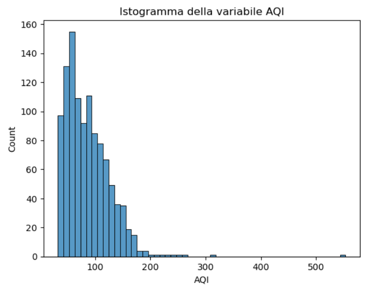

## Introduzione all'AQI
L'indice di qualità dell'aria (AQI) è una misura delle concentrazioni di inquinanti nell'aria ambiente e dei rischi per la salute ad essi associati.
Predizioni accurate dell’AQI sono fondamentali per ottenere valutazioni affidabili della qualità dell’aria. Tuttavia, la presenza di outlier nei dataset utilizzati per l’addestramento dei modelli predittivi può compromettere significativamente l’accuratezza delle stime prodotte incidendo direttamente sulla valutazione  delle performance dei vari modelli adottati.
In questo lavoro, svilupperemo una procedura robusta di identificazione e validazione degli outlier e valuteremo empiricamente l’impatto della loro rimozione sulle prestazioni di diversi modelli di machine learning  utlizzati per la predizione dell’AQI.
L’identificazione degli outlier sarà effettuata mediante una combinazione di tecniche statistiche, tra cui la distanza di Mahalanobis e il range interquartile (IQR). La validazione seguirà un approccio differente rispetto ai metodi standard, ispirato al framework presentato nel paper, che considera separatamente gli effetti di ogni stagione al fine di migliorare la generalizzazione dei modelli su dati non osservati.
 Lo schema proposto verrà testato utilizzando un dataset che include diverse misurazioni effettuate nella città di Bakersfield e nelle aree circostanti, in California. I metodi di machine learning presi in considerazione comprendono sia modelli di regressione lineare sia modelli cosiddetti \emph{ensemble}, ovvero che combinano l’output di più unità distinte per produrre la stima finale (ad esempio il Random Forest Regressor), ed infine il regressore K-Nearest Neighbors.

 ## AQI e Outliers
L’inquinamento atmosferico ha un impatto rilevante sia sulla salute umana sia sull’ambiente. È quindi fondamentale monitorare costantemente i livelli di inquinamento al fine di poterli controllare in modo efficace.

Secondo il report "State of the air" del 2024, diffuso  dall'associazione americana "Lung", la città di Bakersield nello stato della California, rientra nella top-ten delle città americane con i più alti livelli di inquinamento da ozono e particolati nel triennio 19-21.
A Bakersfield, il particolato ($PM$), il biossido di azoto ($NO_2$) e l’ozono ($O_3$) rappresentano le forme di inquinamento atmosferico più comuni. Il $PM_{2.5}$ e il $PM_{10}$ sono indicatori principali dell’inquinamento dell’aria, a causa dei loro effetti nocivi sulla salute e della loro diffusione negli ambienti urbani. Il $PM_{2.5}$ risulta particolarmente pericoloso in quanto penetra più profondamente nei polmoni e nel flusso sanguigno, causando gravi problemi respiratori e cardiovascolari. Anche il $PM_{10}$ comporta rischi per la salute, sebbene in misura leggermente inferiore.

L’individuazione degli outlier riveste un ruolo cruciale nel campo della predizione della qualità dell’aria. Un monitoraggio e una previsione accurati della qualità dell’aria sono fondamentali per la salute pubblica, la gestione ambientale e le decisioni politiche. Gli outlier, ossia osservazioni del dataset  significativamente distanti dal resto delle osservazioni raccolte, possono distorcere le analisi statistiche e i modelli predittivi. Nei dataset sulla qualità dell’aria, tali anomalie possono derivare da malfunzionamenti dei sensori, errori di inserimento dei dati o eventi ambientali rari. Se non vengono rilevati e gestiti correttamente, gli outlier possono influenzare negativamente l’addestramento dei modelli, portando a previsioni inaccurate o parziali. Analizzando e trattando adeguatamente gli outlier all’interno dei dati di training, è possibile migliorare l’accuratezza e la robustezza dei modelli.

    

## Raccolta dei dati e descrizione del lavoro
### Descrizione del Dataset
    

Il presente lavoro, si propone di valutare come la presenza degli outlier influenzi la predizione dell’AQI nella città di Bakersfield in California.

Bakersfield, con i suoi circa $500000$ abitanti, è una delle città più popolate della California, oltre ad essere una delle più vaste con un'estensione di circa 300 $km^2$. Il clima  di Bakersfield è subtropicale arido, con inverni miti e relativamente piovosi, ed estati caldissime e soleggiate. Nei giorni più caldi dell'anno la temperatura può arrivare a 42/43°C, con il caldo afoso che può anticipare l'estate e irrompere già a partire da fine aprile.

Per ottenere il dataset su cui sono state effettuate le analisi, abbiamo utilizzato il portale pubblico dell'US EPA (United States Environmental Protection Agency), in cui vengono messe a disposizione le misurazioni delle concentrazioni medie giornaliere di diversi inquinanti, oltre che i valori giornalieri dell'AQI, a partire dal 1980. In aggiunta, sempre la stessa fonte, mette a disposizione i dati giornalieri di alcuni parametri climatici come risultante della velocità vento, temperatura, pressione atmosferica e punto di rugiada.
Nel portale sono raccolte separatamente le registrazioni annuali relative ad ogni variabile, per migliaia di località USA. Per ottenere quelle relative a Bakersfield, abbiamo filtrato rispetto al campo della località, andando in alcuni casi a selezionari i dati corrispondenti alla prima stazione di registrazione più prossima a Bakersfield, quando quelli per Bakerfield erano indisponibili. Successivamente, abbiamo aggregato in un unico DataFrame Pandas, avente come indice tutte le date dal 1/1/2019 al 31/12/2021, i dati relativi a ciascuna variabile. Infine, abbiamo concatenato i $16$ DataFrame, uno per ogni variabile, allineandoli per data e ottenedo finalmente il dataset definitivo su cui poter effettuare le analisi.

Questa fase di acquisizione e preprocessamento ha rappresentato un passaggio preliminare cruciale all'interno del nostro schema di lavoro poiché ci ha consentito di trasformare dati grezzi, sovrabbondanti e talvolta incompleti, in una rappresentazione pulita, strutturata e adatta all’addestramento dei modelli.

Nella tabella di seguito riportiamo una breve descrizione generale del dataset, mentre nelle due figure l'istogramma della variabile AQI e la matrice di correlazione delle variabili.

| Statistiche del dataset |           |       
|------------------------:|-----------:|       
| Numero di variabili     | 16         |      
| Numero di osservazioni  | 1096       |       
| Valori mancanti         |$\sim$ 15%  |       
| Righe duplicate         | 0          | 

| Tipo delle variabili    |           | 
|------------------------:|----------:|
| Categoriche             | 0         |
| Datetime                | 1         |
| Numeriche               | 15        |

.

## Identificazione e validazione degli Outlier
Un outlier è un’osservazione che si discosta in modo significativo dalle altre e che solleva interrogativi circa la propria origine. In termini statistici, gli outlier sono valori che presentano una deviazione marcata rispetto al valore medio del campione. La presenza di tali osservazioni può influenzare in modo rilevante i coefficienti di un modello di regressione e, più in generale, le prestazioni dei modelli di apprendimento automatico.

Per questo motivo, è fondamentale individuare la presenza di outlier all’interno dei dati prima della fase di addestramento del modello. Se non rilevati e trattati correttamente, gli outlier possono distorcere il processo di apprendimento, conducendo a previsioni imprecise o distorte. Al contrario, un’adeguata analisi e gestione degli outlier consente di migliorare l’accuratezza e la robustezza dei modelli, garantendo che essi apprendano da un campione più rappresentativo della popolazione di riferimento.

Le tecniche di individuazione degli outlier possono essere suddivise in due principali categorie: metodi statistici e metodi basati sul machine learning. I metodi statistici, come lo Z-score e l’Interquartile Range (IQR), sfruttano le proprietà statistiche dei dati per identificare le osservazioni che si discostano in modo significativo dalla distribuzione attesa.

In questo lavoro vengono implementati diversi metodi statistici di individuazione degli outlier, applicati separatamente ai sottoinsiemi di osservazioni corrispondenti a ciascuna stagione. Per ogni stagione, i candidati outlier vengono inizialmente identificati tramite ciascun metodo considerato; successivamente, l’insieme finale degli outlier stagionali è ottenuto selezionando esclusivamente le osservazioni confermate da tutti i metodi adottati.

Poiché i metodi utilizzati si basano su presupposti teorici differenti, le osservazioni individuate in modo congiunto presentano una forte evidenza statistica di anomalia rispetto ai dati osservati. Questa strategia di selezione restrittiva consente perciò di limitare l’inclusione di osservazioni semplicemente estreme ma comunque plausibili all’interno del dataset, concentrando l’analisi su anomalie effettive e statisticamente significative.

Di seguito viene presentato uno schema che riassume i passaggi sequenziali della procedura adottata.

### Distanza di Mahalanobis
La distanza di Mahalanobis rappresenta una misura della discrepanza tra un'osservazione e una distribuzione. Il criterio di selezione degli outlier basato su questa distanza, è progettato per l’analisi di dati multivariati, in quanto tiene conto simultaneamente di più variabili e delle relazioni esistenti tra di esse, espresse attraverso la matrice di covarianza. Per l'implementazione, consideriamo la restrizione del dataset alle sole variabili AQI, $PM_{2.5}$ e $PM_{10}$, ovvero la variabile dipendente e le variabili indipendenti maggiormente correlate a quella dipendente.

A livello matematico, esiste un noto risultato teorico (di seguito enunciato) che afferma come, sotto l’assunzione di normalità multivariata dei dati, il quadrato della distanza di Mahalanobis segua una distribuzione chi-quadrato ($\chi^2$), con un numero di gradi di libertà pari al numero di variabili considerate nel dataset. Di conseguenza, per classificare un’osservazione come outlier è sufficiente confrontare il valore della distanza con una soglia definita dal quantile della distribuzione $\chi^2$, associato al livello di significatività prescelto.

Tuttavia, dall’analisi del Q–Q plot, in cui vengono confrontati i quantili teorici della distribuzione $\chi^2$ con i quantili empirici della distribuzione delle distanze, emerge chiaramente che la variabile AQI si discosta in modo significativo da una distribuzione gaussiana. Ne consegue che anche un insieme di variabili più ampio che includa l’AQI difficilmente potrà soddisfare l’ipotesi di normalità multivariata.

Alla luce di tali considerazioni, si è scelto di applicare la trasformazione di Yeo–Johnson alle variabili AQI, $PM_{2.5}$ e $PM_{10}$,  al fine di rendere le loro distribuzioni marginali — e di conseguenza la distribuzione congiunta — più prossime alla gaussianità.

### Risultato teorico
Se il vettore aleatorio $\mathbf{X}$ segue una distribuzione normale multivariata,

$$
\mathbf{X} \sim \mathcal{N}_n(\boldsymbol{\mu}, \Sigma),
$$

allora la distanza di Mahalanobis al quadrato, definita come

$$
d^2(\mathbf{x}) =
(\mathbf{x} - \boldsymbol{\mu})^\top
\Sigma^{-1}
(\mathbf{x} - \boldsymbol{\mu}),
$$

segue una distribuzione chi-quadrato con $n$ gradi di libertà:

$$
d^2(\mathbf{X}) \sim \chi_n^2.
$$

Di conseguenza, per determinare la soglia di confidenza $q_p$ al livello $\alpha$, tale che

$$
\mathbb{P}\left(d^2(\mathbf{X}) < q_p\right) = \alpha,
$$

utilizziamo il quantile di ordine $\alpha$ della distribuzione chi-quadrato:

$$
q_p = \chi^2_{\alpha,n},
$$

dove $n$ rappresenta il numero di variabili considerate.
Scegliendo un livello di significatività $p=0.05$ per la $\chi^2$ con $3$ gradi di libertà, abbiamo ottenuto $8$ outlier per l'inverno, $2$ per la primavera, $3$ per l'estate e $6$ per l'autunno.

## Range Interquartile
La distanza interquartile (IQD), anche chiamata **Range Interquartile (IQR)** è una misura statistica che quantifica la diffusione di un set di dati calcolando l'intervallo entro cui si trova il 50 % centrale delle osservazioni. È derivato dal primo quartile (Q1) e dal terzo quartile (Q3), che rappresentano rispettivamente il 25° e il 75° percentile dei dati. L'IQR è calcolato sottraendo Q1 da Q3, fornendo una misura solida della variabilità che è meno influenzata da valori anomali rispetto alla gamma complessiva.
I quartili sono valori che dividono un set di dati in quattro parti uguali, ciascuna contenente il 25% dei punti dati.

L'IQR viene utilizzato per definire le soglie inferiori e superiori che catturano la diffusione tipica dei dati osservati. In particolare useremo la convenzione di classificare come outlier le osservazioni che eccedono l' **Upper fence** definita da:

**UpperFence** = Q3 + (1.5  IQR)

e le osservazioni che precedono la **LowerFence** definita da :

**LowerFence**:=Q1- (1.5  IQR) 

Lavorando sulle osservazioni relative alla variabile AQI, abbiamo identficato $20$ potenziali outlier per la stagione invernale, $11$ potenzali outlier per la stagione primaverile, $8$ potenziali outlier per la stagione estiva e $4$ potenziali outlier per la stagione autunnale.
## Z-score robusto
La normalizzazione Z-score, nota anche come standardizzazione, è una tecnica statistica utilizzata per trasformare i dati in un formato standard. Questo metodo comporta il ridimensionamento dei dati in modo che abbiano una media pari a zero e una deviazione standard pari a uno. Applicando la normalizzazione Z-score, possiamo confrontare le osservazioni provenienti  da diverse distribuzioni su una scala comune, il che è particolarmente utile in analisi dei dati e apprendimento automatico.
Lo standard Z-score di un'osservazione **x** è definito da :

$$**z**=\frac{\textbf{x}-\mu}{\sigma}$$

Nonostante i suoi vantaggi, la normalizzazione Z-score ha alcune limitazioni. In particolare, i valori più estremi di un campione di dati  possono aumentare notevolmente la deviazione standard, dando l’impressione che molte osservazioni siano più lontane dalla media di quanto non lo siano in realtà. Questa distorsione può portare a una sottostima della reale entità della deviazione degli outlier rispetto all’intervallo considerato “normale”. Alla luce di queste problematiche, si è preferito adottare il criterio dello Z-score robusto, che mantiene l'approccio della standardizzazione,  rimpiazzando media e deviazione standard con mediana e Mean Absolute Deviation (MAD), due statistiche meno sensibili agli outliers. La mediana M è il valore centrale che divide una distribuzione ordinata in due gruppi di uguale numerosità mentre la MAD definita da :

$$**MAD**:=**mediana**\left(|\mathbf{X}-M|\right)$$

rappresenta la mediana del campione di dati che si ottiene sottranedo la mediana da ogni osservazione del campione di dati di partenza, prendendo il valore assoluto.

Lo Z-score robusto di un'osservazione $\textbf{x}$ è definito da :

$$z_{robust}=\frac{\textbf{x}-M}{MAD}$$

In questo studio è stata adottata la convenzione di classificare come outlier stagionali tutte le osservazioni per le quali il valore assoluto dello Z-score robusto soddisfa la condizione $\lvert z_{\text{robust}} \rvert > 3$. Applicando tale criterio, sono stati individuati 31 outlier invernali, 17 estivi, 35 primaverili e 7 autunnali per la variabile AQI.

Al termine della fase di identificzione degli outlier, abbiamo proceduto con la validazione, seguendo la strategia descritta in precedenza.
Il numero finale di outlier per AQI, ottenuto sommando tutti gli outlier stagionali validati è $11$.

## Modelli di Machine Learning
Una volta identificato l’insieme finale degli outlier, vogliamo quantificare l'impatto della rimozione degli outlier nella previsione della qualità dell'aria. A tal fine, sono stati implementati diversi algoritmi di apprendimento automatico, inizialmente addestrati sull’intero dataset e successivamente riaddestrati dopo aver rimosso le osservazioni classificate come outlier.

Nel seguito viene fornita una breve descrizione dei modelli utilizzati.

## Modelli lineari
Nell’ambito dei modelli lineari, sono stati analizzati la regressione lineare, la regressione Ridge e la regressione Lasso.
Il modello di regressione lineare assume l’esistenza di una relazione lineare tra la variabile dipendente e una o più variabili indipendenti. Ciò implica che una variazione nelle variabili indipendenti produca una variazione proporzionale nella variabile dipendente. 
La relazione di dipendenza tra la variabile indipendente $Y$ e le variabili dipendenti $(X_1,\dots,X_n)$ è espressa da un'equazione lineare della forma:

$$ Y=\beta_0+\beta_1X_1+\dots+\beta_nX_n+\varepsilon $$

L’obiettivo della regressione lineare è stimare i coefficienti $\beta_0,\dots\beta_n$ in modo da minimizzare la differenza tra i valori osservati della variabile dipendente e quelli predetti dal modello lineare. La tecnica predominante per la stima di tali coefficienti è il metodo dei minimi quadrati, che consiste nel minimizzare la somma dei quadrati degli scarti tra le osservazioni reali e le corrispondenti predizioni del modello.

I modelli di regressione Ridge e regressione Lasso sono estensioni della regressione lineare e condividono la medesima struttura di base. Essi introducono tuttavia un termine di regolarizzazione nella funzione obiettivo, con lo scopo di penalizzare valori elevati dei coefficienti e ridurre il rischio di overfitting. In particolare, la regressione Ridge utilizza una penalizzazione di tipo $l^2$, mentre la regressione Lasso impiega una penalizzazione di tipo $l^1$, che consente anche di effettuare una selezione automatica delle variabili.

| Regressione lineare             | Regressione Ridge                                          | Regressione Lasso |  
|--------------------------------:|-----------------------------------------------------------:|------------------:|       
| $$\sum_i^n  (Y_i-\hat{Y_i})^2$$ | $$\sum_i^n  (Y_i-\hat{Y_i})^2 + \lambda \sum_j \beta_j^2$$ | $$\sum_i^n (Y_i-\hat{Y_i})^2 + \lambda \sum_j\lvert\beta_j\rvert$$ |

Nella tabella sono riportate le espressioni della funzione obiettivo per i diversi tipi di regressione. I termini $\hat{Y_i}$ rappresentano i valori predetti della variabile dipendente utilizzando le stime dei coefficienti. Il parametro $\lambda$ presnte nella Ridge e nel Lasso è un iperparametro del modello, ossia un parametro che non viene stimato direttamente dal modello, ma è fissato a priori. La scelta dell’iperparametro viene effettuata tramite tecniche di validazione, come la cross-validation, con l’obiettivo di ottimizzare le prestazioni predittive del modello e prevenire fenomeni di overfitting o underfitting (nella sezione successiva illustreremo brevemente le tecniche implementate per la scelta degli iperparametri).

Lo schema di lavoro adottato, prevede la separazione casuale del dataset in due sottoinsiemi distinti:
- il **training set**, utilizzato in prima battuta per effettuare la validazione incrociata, attraverso la quale la procedura adoperata per ottimizzare l'iperparametro $\lambda$ stabilisce la configurazione ottimale, e successivamente per ottenere la stima dei coefficienti del modello lineare una volta fissato l'iperparametro scelto.
- il **test set** mantenuto separato durante la fase di addestramento e impiegato unicamente per la valutazione delle prestazioni predittive del modello lineare. 
    
In questo lavoro, per quanto riguarda i modelli lineari, abbiamo utilizzato l'intero dataset come insieme per l'addestramento
## Modelli ensamble
I modelli ensamble rappresentano una tecnica sofisticata di apprendimento automatico in cui le previsioni di modelli indipendenti vengono combinate per generare un unico risultato finale di qualità superiore. Piuttosto che affidarsi alla capacità decisionale di un solo algoritmo, un ensemble model sfrutta il principio della "saggezza della folla" per migliorare l'accuratezza e la stabilità complessive. Aggregando i risultati di diversi modelli, si riesce a ridurre in modo significativo il rischio di overfitting e creare sistemi molto più robusti rispetto al rumore dei dati dati di addestramento.
Ad esempio, i metodi basati su alberi decisionali (come Random Forest Regressor) suddividono lo spazio predittivo in regioni semplici e adattano, in ciascuna, un modello elementare . Le predizioni si ottengono poi utilizzando il valore medio  della variabile responso nelle osservazioni di addestramento appartenenti alla stessa regione. Le regole di suddivisione possono essere rappresentate tramite un albero decisionale, rendendo il modello interpretabile.

Per quanto riguarda lo studio, i modelli di tipo ensemble implementati sono: il Random Forest Regressor, il Gradient Boost Regressor e l’Extra Trees Regressor. Anche in questo caso, il dataset è stato suddiviso in un \emph{training set}, utilizzato per l’addestramento dei modelli, e in un \emph{test set}, impiegato per valutare l’accuratezza delle predizioni e la capacità dei modelli di generalizzare su dati non precedentemente osservati.
## Regessore K-Nearest Neighbors
A differenza dei modelli di regressione lineare, che assumono una specifica formulazione parametrica per la funzione di predizione, il regressore K-Nearest Neighbors, adotta un approccio più flessibile, basato su un'idea piuttosto semplice.
Infatti, il regressore KNN stima il valore della variabile dipendente per un certa osservazione $\mathbf{x_0}$ identificando le $K$ osservazioni di addestramento più vicine a $\mathbf{x_0}$, denotate con $\mathrm{N_0}$. La predizione viene quindi calcolata come la media della variabile responso 
delle $K$ osservazioni più vicine. In altre parole, $\hat{f}(\mathbf{x_0})$ vine stimato come:

$$ \hat{f}(\mathbf{x_0})=\frac{\sum_{i\in \mathrm{N_0}}Y_i}{|\mathrm{N_0}|} $$

La predizione si basa esclusivamente sui punti più simili nel dataset di addestramento. I concetti di "vicinanza" e "similitudine" vengono formalizzati definendo  una specifica distanza.
Il parametro $K$ è un iperparametro per il modello che deve essere selezionato a priori tramite apposite tecniche di validazione.

## Metodi per l'ottimizzazione degli iper-parametri
Come accennato nella precedente sezione, la maggior parte dei sistemi di apprendimento automatico (inclusi quelli messi a punto per le nostre analisi) si basano su iperparametri.

La fase di ricerca e ottimizzazione degli iperparametri, comunemente indicata con l'acronimo inglese HPO, rappresenta una delle attività più onerose e complesse nei progetti di ML. L'automatizzazione  dell'HPO, riveste un ruolo cruciale per i seguenti motivi:
- riduce l'impegno e il tempo che l'uomo deve dedicare al ML
- incide in maniera determinante sulla performance degli algoritmi garantendone il miglioramento
- migliora la riproducibilità e l'imparzialità degli studi scientifici

Matematicamente, l'HPO rappresenta la procedura attraverso cui selzionare il valore di un certo iperparametro $\lambda$, in modo da minimizzare l'errore generalizzato definito come 

$$\mathbb{E}_{X\sim \mathrm{D}}\left[\mathcal{L}(X,\mathcal{A}_{\lambda}(X^{(train)})) \right]$$

In altri termini, $\lambda^{*}$, ovvero la miglior scelta possibile dell'iperparametro, deve soddisfare:

$$\lambda^{*}:=argmin_{\lambda}\mathbb{E}_{X\sim \mathrm{D}}\left[\mathcal{L}(X,\mathcal{A}_{\lambda}(X^{(train)})) \right]$$

dove $\mathcal{L}$ rappresenta una qualche funzione di costo e $\mathcal{A}_{\lambda}$ l'algoritmo di apprendimento una volta fissato l'iperparametro $\lambda$.

Comunemente, invece di valutare separatamente una singola funzione di costo
$\mathcal{L}$, si adotta il protocollo della **cross-validation**, che consiste nel suddividere il dataset di training in più sottoinsiemi casuali e nel valutare le prestazioni del modello attraverso ripetute fasi di addestramento e validazione. Questo approccio consente di ottenere una stima più robusta e affidabile della performance del modello, riducendo la dipendenza dai risultati ottenuti su un singolo campione dei dati.

## Grid e Randomized Search
La Grid Search è il metodo concettualmente più semplice per performare HPO. L'utente si deve limitare a specificare un sottoinsieme finito di valori plausibili per ognuno degli iperparametri e la Grid Search valuta il prodotto cartesiano di tali sottoinsiemi. Lo svantaggio principale di questa tecnica è rappresentato dalla possibile elevata dimensionalità dello spazio parametrico fornito in input che si traduce in un numero considerevole di istanze di Cross-Validation da dover effettuare e una conseguente elevata complessità computazionale.

La Randomized Search  rappresenta un'altrernativa alla Grid Search che, se opportunamente implementata, può ridurre notevolmente la complessità computazionale. Come suggerito dal nome, questo procedimento, invece di valutare l'intero prodotto cartesiano dei sottoinsiemi parametrici, ne considera solamente un campione casuale di configurazioni, fino al raggiungimento di un tetto massimo di ricerche fissato a priori.
Poiché le configurazioni vengono selezionate in modo casuale, la Random Search presenta lo svantaggio di non garantire l’esplorazione delle configurazioni ottimali, soprattutto quando il numero massimo di tentativi impostato per la ricerca è limitato.
## Ricerca Bayesiana
Il metodo della ricerca bayesiana, è un algoritmo iterativo che si serve di due ingredienti fondamentali: un modello probabilistico surrogato e una funzione di acquisizione per decidere quale punto valutare all'iterazione successiva. Ad ogni iterazione, il modello surrogato viene adattato a tutte le osservazioni della funzione obiettivo raccolte fino a quel momento. Successivamente, la funzione di acquisizione, che sfrutta la distribuzione predittiva del modello probabilistico, determina l'utilità dei diversi punti candidati, bilanciando l'esplorazione dello spazio dei punti e lo sfruttamento delle informazioni già disponibili.
Dal momento che la ricerca bayesiana applicata all'HPO indirizza l'esplorazione verso le regioni più promettenti dello spazio degli iperparametri, può risultare molto più efficiente rispetto a Grid e Randomized Search.

Nel presente lavoro sono state implementate tutte le tecniche di HPO descritte. In particolare, per quanto riguarda l’approccio di ricerca bayesiana, si è fatto ricorso ad  Optuna, un potente  framework di ottimizzazione degli iperparametri in Python progettato per automatizzare e semplificare il processo di ottimizzazione.

Gli iperparametri oggetto di ottimizzazione includono :

- il parametro di regolarizzazione $\lambda$ nei modelli di Ridge e Lasso Regression, che controlla l’intensità della penalizzazione applicata ai coefficienti
- la profondità massima degli alberi **max\_depth** e il numero di stimatori , **n\_estimators** nei modelli Random Forest ed Extra Trees Regressor che influenzano rispettivamente la complessità del modello e la sua capacità di generalizzazione
- la profondità massima degli alberi nel Gradient Boosting Regressor, parametro che regola il compromesso tra accuratezza e rischio di overfitting.
- il parametro $K$ del Nearest-Neaghboor Regressor che stabilisce il numero di punti più vicini da considerare

## Metriche per la valutazione della performance
Le metriche adottate in questo studio per valutare le performance predittive dei diversi modelli di regressione  sono il coefficiente di determinazione $R^2$ e l'errore quadratico medio (MSE) 
### $\mathbf{R^2}$
Quando si valuta un modello utilizzando il coefficiente di determinazione $R^2$, l'obiettivo è quello di misurare quanto le predizioni si adattino ai valori osservati. L' $R^2$ misura la proporzione della varianza nella variabile dipendente che è spiegata dalle variabili indipendenti. Valori elevati di $R^2$ indicano migliori prestazioni, con un valore massimo pari a $1$ che corrisponde a un fit perfetto.

In conclusione, l'$R^2$ aiuta nell'ottimizzazione del modello misurando la varianza spiegata al fine di migliorare l'accuratezza delle predizioni su dati non osservati.

$$ R^2=1-\frac{\sum_i(Y_i-\hat{Y_i})^2}{\sum_i(Y_i-\overline{Y})^2}$$

dove 

$$\overline{Y}=\frac{\sum_{i=1}^n Y_i}{n}$$

### MSE
L’errore quadratico medio (MSE) è una misura della discrepanza tra i valori predetti dal modello e quelli effettivamente osservati. Matematicamente, corrisponde alla media dei quadrati degli scarti, ovvero alla media dei quadrati delle differenze tra i valori osservati e quelli predetti dal modello:

$$ MSE=\frac{\sum_{i=1}^n(Y_i-\hat{Y_i})^2}{n}$$

Valori bassi del MSE indicano una migliore performance, con un valore di MSE pari a $0$ che rappresenta un fit perfetto.
## Confronto dei risulati e conclusioni
### Analisi comparativa dei modelli prima e dopo l'eliminazione degli outlier
Nell’ultima fase del lavoro, i modelli sono stati messi a confronto, considerando prima l'implementazione sul dataset di partenza  e succesivamente  sul dataset ottenuto rimuovendo gli  outlier, validati a livello stagionale seguendo il protocollo descritto in precedenza. 
I risultati mostrano un miglioramento consistente delle prestazioni predittive per tutti i modelli considerati, sia quelli lineari sia qelli di tipo ensemble, misurato in termini di incremento del coefficiente $R^2$.
In particolare, i modelli ensemble — Random Forest Regressor ed Extra Trees Regressor — sono quelli che hanno beneficiato maggiormente della rimozione degli outlier, con valori di $R^2$ che passano da circa $0.8$ o leggermente inferiori (Extra Trees Regressor) a valori prossimi a $0.9$. Sebbene non della stessa entità, anche il modello K-Nearest Neighbors mostra un miglioramento apprezzabile, evidenziando  come il calcolo delle distanze, operazione cruciale per mettere a punto le predizioni, sia fortemente influenzato dai valori anomali.
Infine, per quanto riguarda i modelli Ridge e Lasso, la procedura di Grid Search (considerando separatamente i dataset di training in presenza e in assenza di outlier) ha restituito in tutti i casi valori del coefficiente di regolarizzazione prossimi allo zero, tranne che per il modello Ridge base, indicando come questi termini abbiano avuto un impatto trascurabile sulla stima dei coefficienti. Ciò si è tradotto in prestazioni pressoché analoghe a quelle della regressione lineare standard. 

## Commento finale
In questo lavoro è stato analizzato l’impatto degli outlier sulla predizione dell’Air Quality Index (AQI) per la città di Bakersfield in California. Dopo una fase iniziale di raccolta e processamento dei dati, i potenziali outlier sono stati individuati combinando diversi metodi statistici. La loro validazione è stata condotta adottando un criterio restrittivo su base stagionale, al fine di tenere conto della variabilità intrinseca dei dati legata a pattern tipici di ciascuna stagione (ad esempio specifiche condizioni ambientali e attività umane) e di selezionare esclusivamente osservazioni caratterizzate da una forte evidenza statistica di anomalia. Infine, sono stati implementati diversi modelli di machine learning e ne sono stati confrontati i risultati ottenuti prima e dopo la rimozione degli outlier, evidenziando un miglioramento complessivo delle prestazioni predittive.
    
Per i dettagli relativi all’implementazione dello studio, si rimanda alla consultazione del Jupyter Notebook, in cui sono riportate integralmente tutte le fasi pratiche, incluse la preparazione dei dati, la generazione dei grafici e l’esecuzione dei modelli con il calcolo dello score ottenuto.

